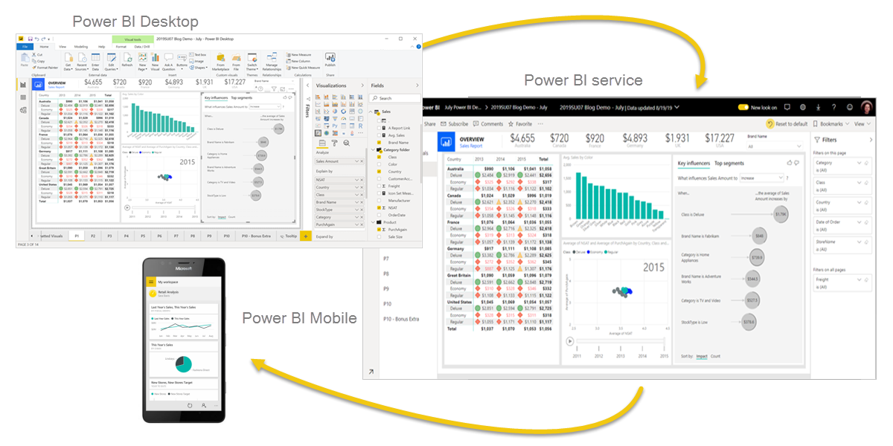

# Power BI Overview

Power BI is a powerful business analytics tool developed by Microsoft that enables users to visualize data and share insights across an organization. There are three primary components to Power BI:

## Primary Components of Power BI

### 1. Power BI Desktop
- A free desktop application.
- Used by data analysts and report creators.
- Enables connecting to data, transforming it, modeling, and creating visualizations.
- Can be downloaded from the Windows Store or directly from the internet.

### 2. Power BI Service
- An online SaaS (Software as a Service) platform.
- Used for organizing, managing, and distributing reports.
- Accessible at [app.powerbi.com](https://app.powerbi.com) with a work or school account.
- Free trials and Microsoft 365 Developer accounts are available for new users.

### 3. Power BI Mobile
- A cross-platform mobile application.
- Allows users to view reports in a mobile-optimized format.
- Mobile-optimized views can be created in Power BI Desktop.

## The Parts of Power BI

### Common Workflow
The typical flow when creating reports with Power BI involves:

1. **Connect to data** using Power BI Desktop.
2. **Transform and model** the data in Power BI Desktop.
3. **Create visualizations and reports** in Power BI Desktop.
4. **Publish reports** to the Power BI Service.
5. **Distribute and manage** the reports using the Power BI Service.

### Additional Features
- The Power BI Service allows for the creation of high-level dashboards.
- Dashboards can drill down into detailed reports.
- Apps can be created to group related reports and dashboards for simplified user access.

Power BI enables users to turn raw data into meaningful insights through an intuitive interface and collaborative features across devices.

