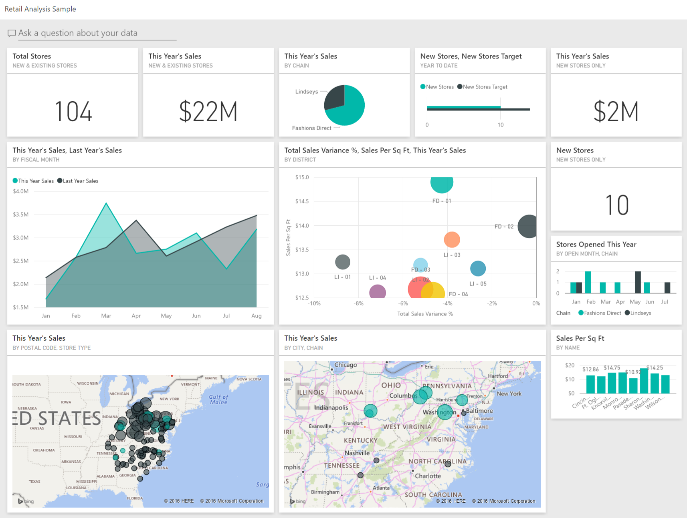

# Building Blocks of Power BI

Power BI enables users to transform data into interactive and meaningful insights. The two fundamental building blocks in Power BI are **semantic models** and **visualizations**. Let's explore how these components work together to create powerful reports and dashboards.

---

## 📘 Create a Semantic Model

A **semantic model** includes:
- Connected data sources
- Transformed and cleaned data
- Relationships between tables
- Calculations and measures

### 🔄 Steps to Create a Semantic Model:
1. **Connect** to one or more data sources.
2. **Transform and clean** the data using Power Query.
3. **Create relationships** between your tables.
4. **Add calculations** (measures and columns) as needed.

✅ Once the semantic model is ready, you’re set to build visual reports.

---

## 📊 Create Visualizations in a Report

In **Power BI Desktop**, reports are built by placing **visualizations** on a canvas.

### 🎨 Key Features:
- **Drag and drop** fields to create visuals easily.
- Power BI automatically suggests a visual type based on the data.
- You can **change visuals** anytime and customize data fields.
- Each report can have **multiple pages**, each with its own layout and focus.

### ✨ Interactivity:
- **Clicking on one visual** can highlight or filter others.
- **Drillthroughs** allow users to navigate from summary to detail.
- Reports remain dynamic and interactive for consumers.

---

## 📌 Create a Dashboard

After publishing a report to the **Power BI service**, you can create **dashboards**.

### 📐 What is a Dashboard?
- A **single-page** layout.
- Made up of **tiles** pinned from reports.
- Dashboards are **not interactive**, but clicking a tile opens the full report.

### 📎 How to Build:
1. Open your published report in the Power BI Service.
2. **Pin** important visuals to a new or existing dashboard.
3. Use the dashboard to **monitor key metrics** at a glance.

---

## 🧠 Recap
- **Semantic models** provide structured, meaningful data.
- **Visualizations** turn that data into insights in reports.
- **Dashboards** offer a quick, high-level overview for consumers.

Using Power BI Desktop, you build the foundation. In the Power BI Service, you manage, share, and expand your insights.

