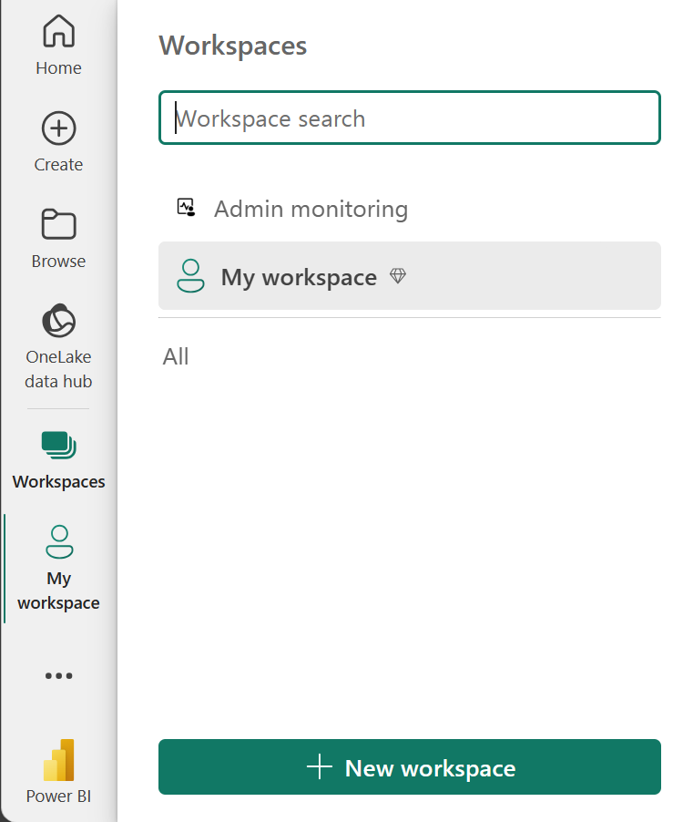
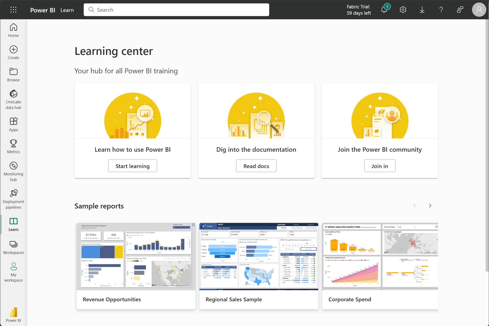
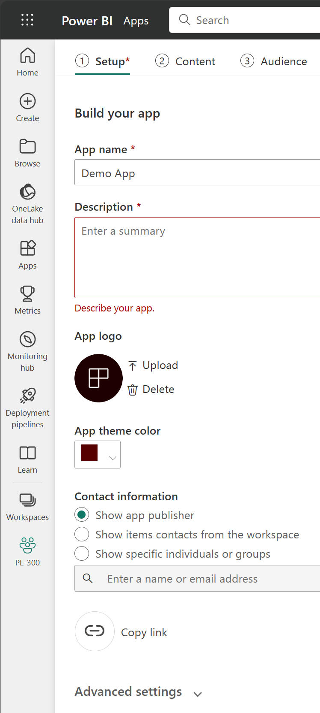
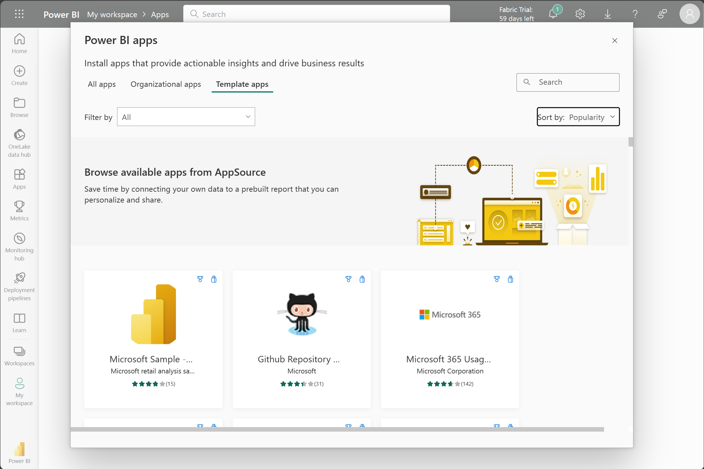
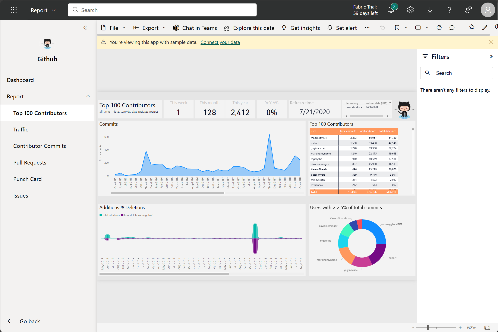
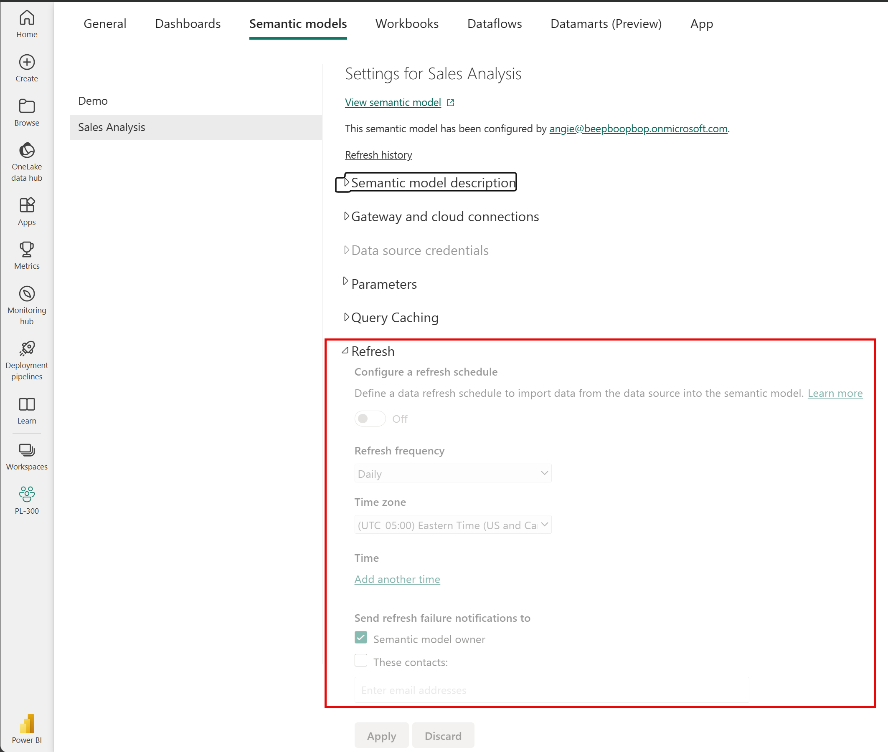

# Tour and Use the Power BI Service

Now that you understand how to create a report, let's explore the **Power BI service**. The Power BI service provides a simple and interactive user experience to take your data analytics to the next level.

---

## 🗂 Organize Items with Workspaces

**Workspaces** are the foundation of the Power BI service. When publishing any report, you must choose a workspace.

- By default, every user has access to **My workspace**, which is ideal only for testing.
- When you want to share content with others, always create and use a **shared workspace**.

---

## 📊 Explore Sample Reports

If you haven't created a report yet, Power BI offers several **sample reports** for you to explore. These reports are loaded into **My workspace**, so you can explore privately.

You can access sample reports in the **Learn** section of the navigation pane.

---

## 📤 Distribute Content

In a workspace, you can create an **app**, which provides consumers with a simplified interface to access reports and dashboards.

### App Configuration:
- Set up the app
- Select content to include (only from the current workspace)
- Choose your audience

⚠️ **Important:**  
After making any changes to items in the workspace, you **must update the app** to reflect those changes to users. This allows you to control what version of content is visible to your audience.

### Why use Apps?

- Apps are the **ideal sharing solution** within any organization.
- Granting access to the workspace may expose more content than intended.
- Sharing individual items can be problematic if updates aren't ready for consumers.

---

## 📦 Explore Template Apps

Template apps allow you to find an existing app that suits your needs and **connect your own data**.

These apps are a great way to **quickly share insights** with minimal effort.

### 🔍 How to Access Template Apps:
1. Select the **Apps** icon from the left navigation pane.
2. Click **Get apps**
3. Choose **Template apps**

> 💡 Tip: In the following screenshot, we've installed the **GitHub template app** and expanded the report to see pages like _Top 100 Contributors_ and _Pull Requests_.

---

## 🔁 Refresh a Semantic Model

To support your ever-changing data, configure **scheduled refreshes** of your semantic models in the Power BI service.

You can also perform **on-demand refreshes**.

> 💡 **Tip:**  
For more information about all refresh schedules, see the [Refresh data documentation](https://learn.microsoft.com/power-bi/connect-data/refresh-data).

---
