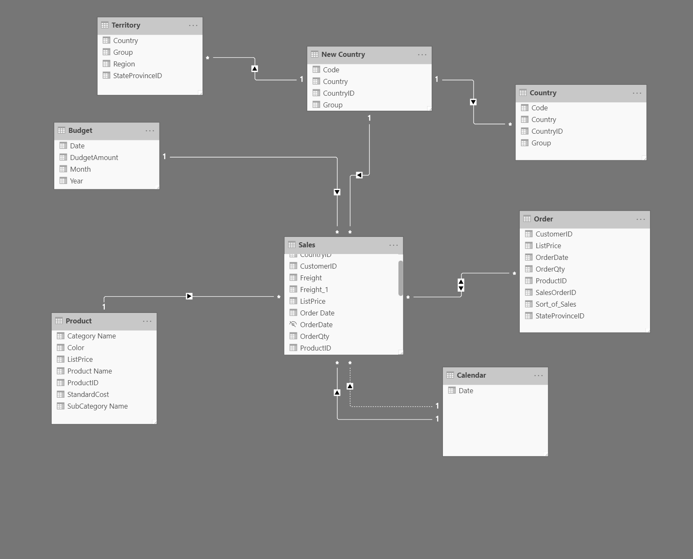

## Create interactive reports using Copilot for Power BI

### Introduction

Microsoft Power BI helps you prepare and visualize your data with interactive reports. If you're new to Power BI, it can be hard to know where to start, and creating reports can be time consuming. Copilot for Power BI makes it easier to turn data into insights quickly.

In this module, you learn the concepts of using Copilot for Power BI to create reports efficiently, including how to create measures, design visuals, and build entire report pages. By the end, you'll have the knowledge to use Copilot for Power BI to make data analysis and reporting easier and more effective.

## Next unit: Prepare your data for use with Copilot for Power BI

Microsoft Power BI enables you to develop interactive reports within a single tool. Typical report development consists of the following steps:

- Prepare and model data
- Visualize and analyze data
- Secure and distribute reports
 
Each step can be time consuming and intimidating to new Power BI users, depending on the complexity of the data and the requirements for the report. You can reduce the amount of time spent creating reports by using Copilot for Power BI to perform certain tasks, such as:

- Create measures based on natural language.
- Update the semantic model with synonyms for improved user Q&A experience.
- Generate report content, summary visuals, and pages from prepopulated prompts.
- Analyze a summary of underlying semantic model.

However, you still perform the initial data cleansing and transformation tasks, which are crucial to ensure accuracy in reporting.

### Ensure data quality
You also need to evaluate your semantic model for different aspects of data quality, or Copilot might not be effective.

Data quality is crucial when creating a Power BI report because it directly affects the accuracy and reliability of the insights you can derive from your data. Here are examples of how data quality can affect the successful creation of a Power BI report:

- **Completeness:** Missing values can cause gaps.
- **Validity:** Out-of-range data values can skew visuals and results.
- **Consistency:** Inconsistent data can affect date-related visuals.
- **Uniqueness:** Duplicates can affect data accuracy.
- **Data Relationships:** Cross-table visuals might not be possible without relationships.
- **DAX Calculations:** Limited calculations can result in fewer possible insights.

### Prepare data with Power Query
Power Query is a key feature of Power BI Desktop to prepare your semantic model. It's the initial step in creating a Power BI report and is indispensable when using Copilot. Use Power Query to ensure data quality:

**Profile your data** by assessing column quality, distribution, and profile.
**Clean your data** by resolving inconsistencies, unexpected or null values, and other data quality concerns.
**Transform your data** by implementing user-friendly naming conventions for columns and queries, altering column data types, and applying data shape transformations.

## Use Copilot for Power BI to model your data

Properly prepared data is the foundation for data insights. Once you clean, transform, and shape your data, you can start to design the semantic model.

### Connect tables with relationships
Your next step is to create relationships between tables. Relationships allow you to filter and summarize data in report visuals later in the development process. You can use the autodetect relationships feature to get you started, then use Copilot to summarize the initial semantic model to determine if any other relationships are needed.

In the following image, there's a single fact table with dimension tables connected by relationships. Power BI reports work best when using a star or snowflake schema for the semantic model.

### Create summaries with Copilot for Power BI

Summaries keep the audience engaged by providing a clear and concise overview, ensuring the core message is communicated effectively. Summaries also provide context and highlight important aspects, as part of the storytelling process.

### Summarize with the Narrative visual
The Narrative visual allows you to create a custom visual that summarizes and references data within your report visuals. Custom narratives give more control over formatting and text. Copilot created summaries include the following suggested prompts:

- Give an executive summary
- Answer likely questions from leadership
- Create a bulleted list of insights
- You can also enter a custom prompt. Choose to reference all visuals on the current page or specific visuals to include in the summary. This visual is available in both Power BI Desktop and service. You can also switch between the custom and Copilot summaries to compare.