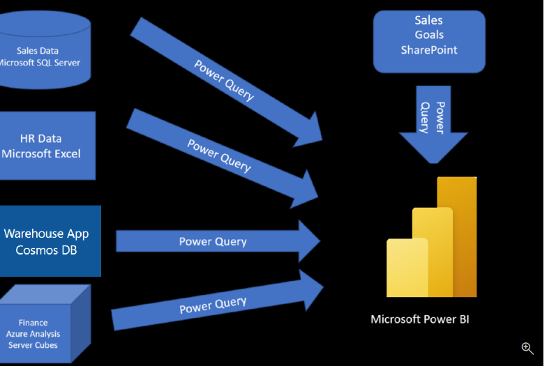

# 📘 Introduction to Getting Data in Power BI

Like most of us, you work for a company where you're required to build **Microsoft Power BI reports**. The data you need lives across multiple platforms—**Microsoft SQL Server**, **Microsoft Excel**, and more. Even though the data sources are different, they're all **related**.

> 📝 **Note**  
> The sections of this module prior to the lab are informational. You'll work with real data during the lab.

---

## 🏢 Scenario: Tailwind Traders

You're working at **Tailwind Traders**, and senior leadership has asked you to create a suite of reports using data stored in **multiple locations**.

### 🔗 Data Sources Overview:

- **Sales Transactions** – stored in **SQL Server** (relational database)  
  - Tracks what each customer bought and when  
  - Tracks the employee who made the sale (name & ID)  
  - ❌ Does **not** include hire date, title, or manager info

- **Employee Info** – stored in **Excel files** managed by Human Resources  
  - Includes hire date, title, and manager  
  - You've asked for a SQL-based system, but it's not in place yet

- **Shipment Data** – stored in **Cosmos DB**  
  - Stored as **JSON documents**  
  - Comes from the new warehousing application

- **Financial Projections** – stored in **Azure Analysis Services**  
  - Helps forecast future sales based on trends

---

## 🧱 Building Reports – The Process

Before you can create reports, you need to **extract and prepare** data from various sources. Here's a high-level view of the process:

1. **Extract data** from SQL Server, Excel, Cosmos DB, and Azure Analysis Services
2. Use **Power Query** to:
   - Rename columns
   - Replace values
   - Remove errors
   - Combine results
3. Once data is cleaned and organized:
   - Build your reports in Power BI
   - Publish the **semantic model** and reports to Power BI Service
   - Share reports or allow others to build on your semantic model

> 💡 Tip: Power Query is also available in Excel, making it a versatile tool for data transformation.

---

## 🎯 Learning Objectives

By the end of this module, you’ll be able to:

- ✅ Identify and connect to a **data source**
- ✅ Get data from a **relational database**, such as **Microsoft SQL Server**
- ✅ Get data from a **file**, such as **Microsoft Excel**
- ✅ Get data from **applications**
- ✅ Get data from **Azure Analysis Services**
- ✅ Select an appropriate **storage mode**
- ✅ Fix **performance issues**
- ✅ Resolve **data import errors**

---

> 🛠️ This module focuses on the **first step**: getting data from various sources and importing it into Power BI using **Power Query**.

