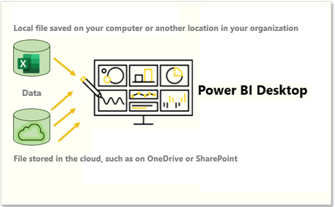
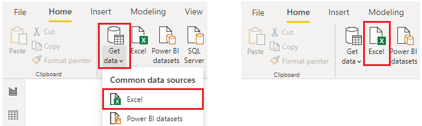
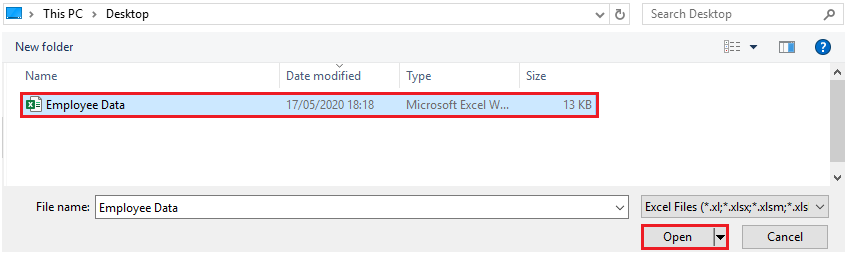
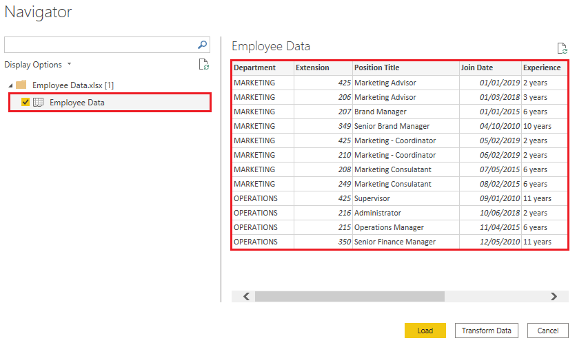
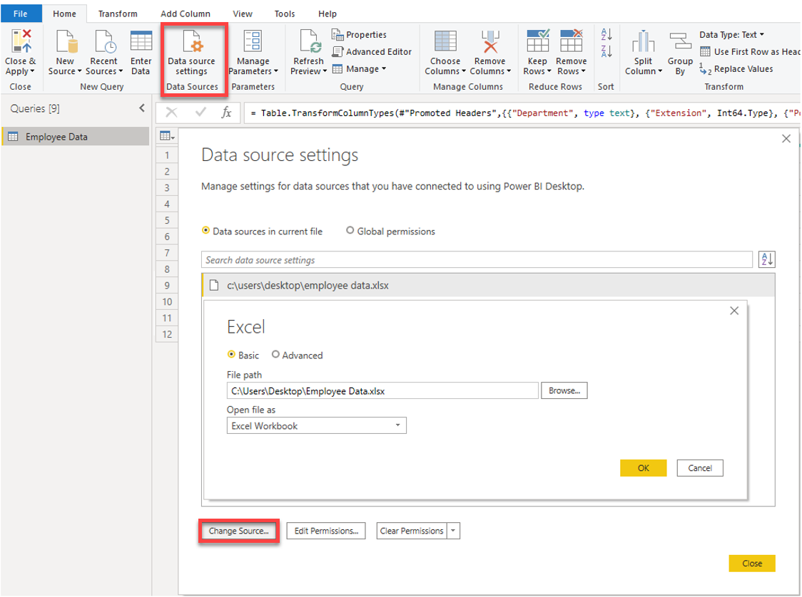

# Importing Data from Files into Power BI

## Overview
Organizations often export and store data in files. These files can take several formats, commonly:

- **Flat Files**: Contain a single data table with consistent row structure and no hierarchies. Examples include:
  - CSV (.csv)
  - Delimited text (.txt)
  - Fixed width text
- **Application Output Files**:
  - Microsoft Excel workbooks (.xlsx)

Power BI Desktop supports importing from various file types using the **Get data** feature.

### Scenario
The Human Resources (HR) team at BANK ASIA has prepared a flat file that contains some of your organization's employee data, such as employee name, hire date, position, and manager. They've requested that you build Power BI reports by using this data, and data that is located in several other data sources.

## File Location Options
When importing Excel files, consider the file's location, which affects refresh and synchronization behavior:

- **Local**: Imports a static snapshot of the file. Changes to the file won't reflect in Power BI unless re-imported.
- **OneDrive for Business**: Enables automatic sync between the Excel file and Power BI model, reports, and dashboards.
- **OneDrive - Personal**: Similar to OneDrive for Business, but requires personal account sign-in.
- **SharePoint - Team Sites**: Comparable to OneDrive for Business. Connection is made using a URL or root folder path.

> ✅ Cloud-based storage options are best for keeping reports in sync with updated data.

## Connecting to File Data
1. Open **Power BI Desktop**.
2. Navigate to the **Home** tab and click **Get data**.
3. Select your file type, such as **Excel**.

4. Locate and open the target file (e.g., `Employee Data.xlsx`).

## Selecting Data to Import
Once connected:
- The **Navigator** window displays tables or entities available in the file.
- Preview the data and check the desired table(s).
- Choose between:
  - **Load**: Directly imports data into Power BI.
  - **Transform Data**: Opens Power Query Editor to clean and modify data before import.

> 💡 It's recommended to transform data for better quality and performance.

## Changing the Source File
If the source file moves or is renamed, you can update the file path:

1. In Power BI Desktop, go to **Data source settings**.
2. Select the data source and click **Change Source**.
3. Enter a new path or browse to the new file.
4. Confirm changes and close the dialog.

> ⚠️ Ensure the new file has the same structure (column names/types) to prevent breaking the data model.

## Summary
Power BI provides flexible methods for importing and managing data from files. Whether the data resides on your local drive or in the cloud, understanding the implications of each source location and using Power Query for data preparation ensures your reports are reliable and current.