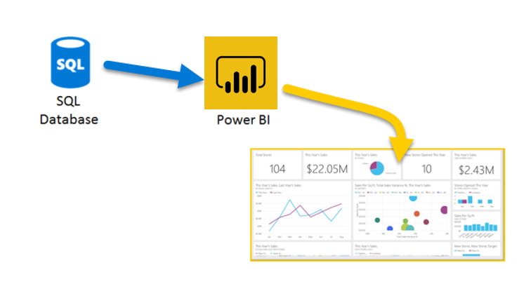
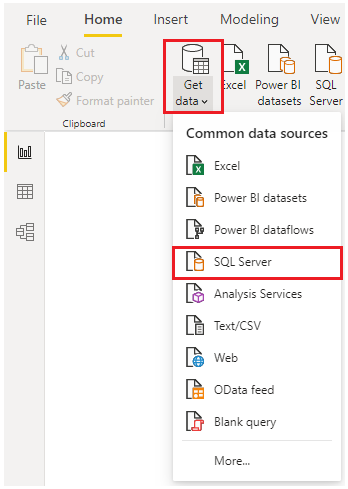
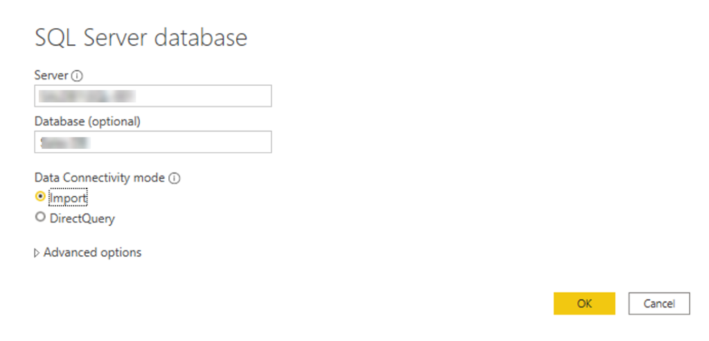
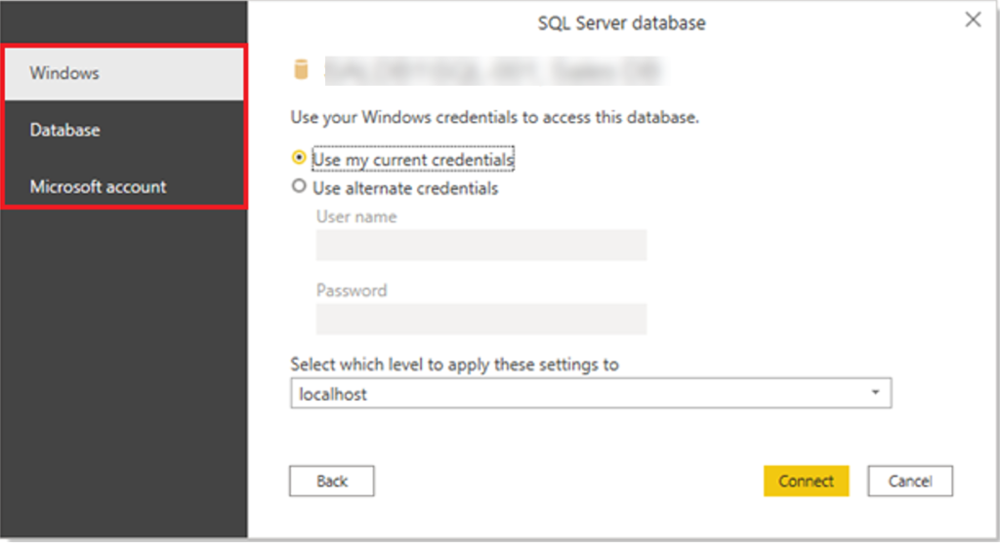
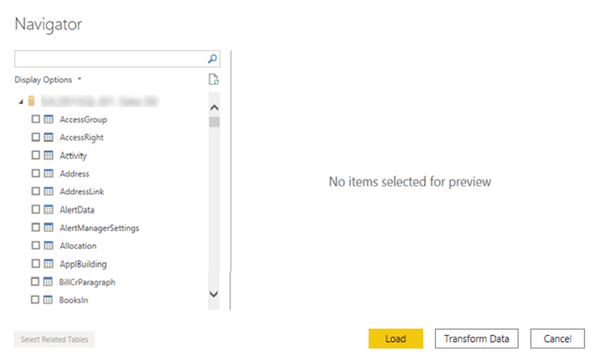
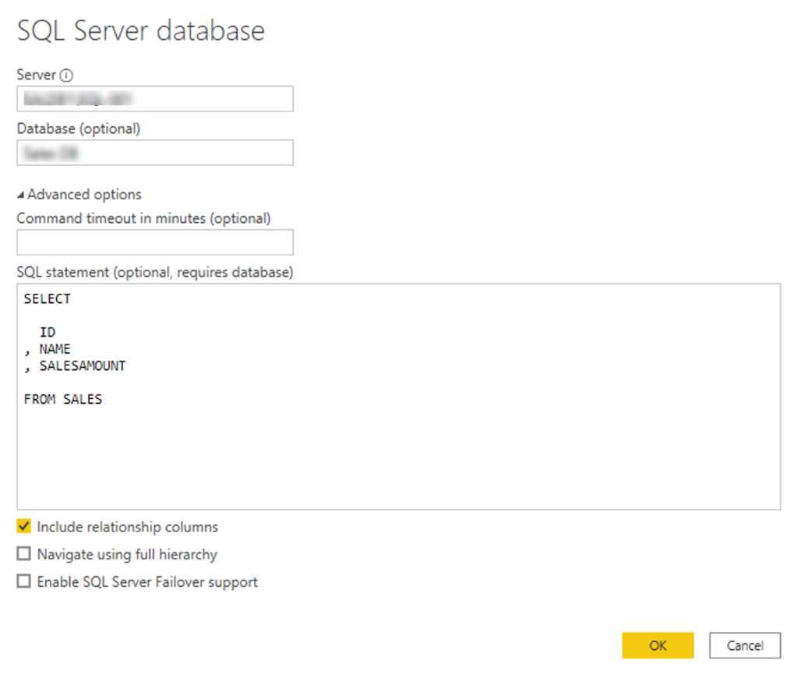
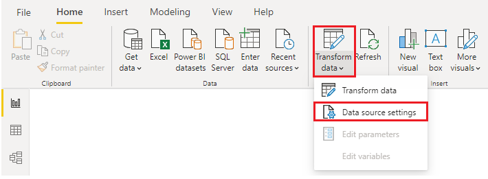
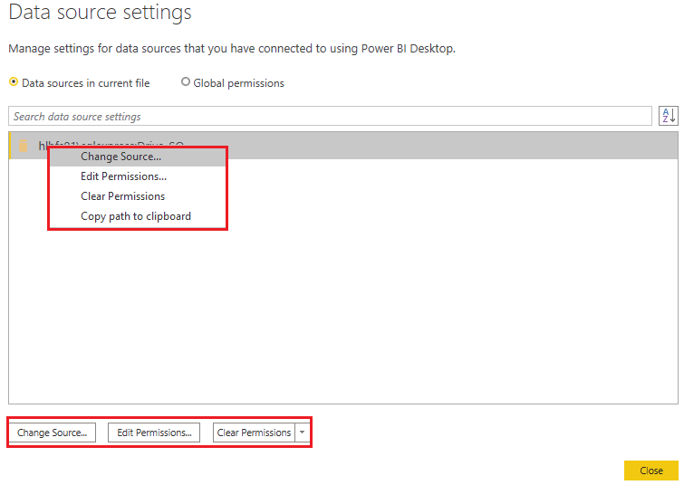
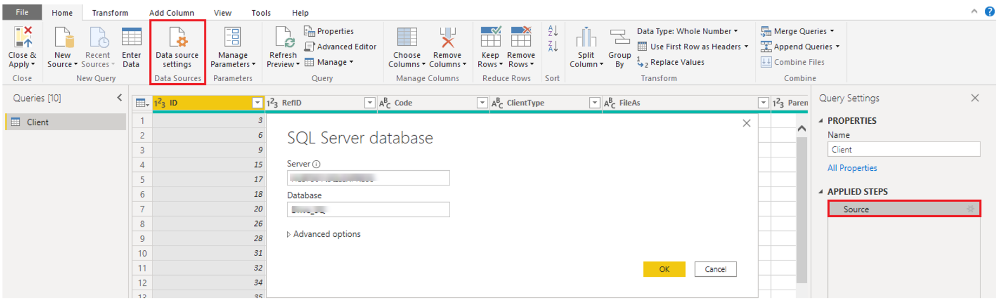

# Get Data from Relational Data Sources

## Introduction
If your organization stores sales data in a relational database, Power BI Desktop allows you to connect directly to that source, eliminating the need for exported flat files. Connecting to relational databases in Power BI helps you monitor business performance, analyze trends, forecast sales, plan budgets, and set performance indicators.

Power BI Desktop supports many relational databases, whether hosted on-premises or in the cloud.

---

## Scenario: Connect to SQL Server
The Sales team at BANK ASIA has requested that you connect Power BI Desktop to their on-premises **SQL Server** database to retrieve sales data for building dynamic sales reports.



---

## Step-by-Step: Connect to Relational Data

### 1. Open Power BI Desktop and Get Data
- Go to the **Home** tab.
- Click **Get data**.
- Select **SQL Server** from the list.

> Tip: Commonly used data sources like SQL Server are pinned next to the Get Data button.



---

### 2. Enter Database Connection Details
- In the **SQL Server database** window:
  - Enter **Server name**
  - Enter **Database name** (optional)
  - Choose **Data Connectivity Mode**:
    - **Import** *(default and recommended)*
    - **DirectQuery**

> You can ignore Advanced Options for now unless you're writing a custom SQL query.



---

### 3. Authenticate
Power BI prompts for login credentials:
- **Windows**: Use your Windows (or Azure AD) credentials.
- **Database**: Use the database-specific username and password.
- **Microsoft Account**: For Azure-hosted services.



---

### 4. Select Data to Import
Once connected, Power BI displays the **Navigator** window listing available tables.

- Check the box beside the desired table(s).
- Choose:
  - **Load**: Imports data into the model.
  - **Transform Data**: Opens Power Query Editor for data cleansing.



---

### 5. Optional: Write a SQL Query to import data

Another way you can import data is to write an SQL query to specify only the tables and columns that you need.

To write your SQL query, on the SQL Server database window, enter your server and database names, and then select the arrow next to Advanced 
options to expand this section and view your options. In the SQL statement box, write your query statement, and then select OK. 
In this example, you'll use the Select SQL statement to load the ID, NAME and SALESAMOUNT columns from the SALES table.

To load only specific columns or rows:
- In the **SQL Server database** window, expand **Advanced options**.
- Write your SQL query in the provided box.

Example:
```sql
SELECT
  ID,
  NAME,
  SALESAMOUNT
FROM SALES
```



#### Use WHERE clause for filtering:
```sql
SELECT
  ID,
  NAME,
  SALESAMOUNT
FROM SALES
WHERE OrderDate >= '2020-01-01'
```

> Avoid using `SELECT *` to prevent performance issues and excessive data loading.

---

## Best Practice: Use Views Instead of Direct Queries
Instead of writing SQL directly in Power BI, consider using a **View** in the database:
- A View is a virtual table based on an SQL query.
- Power BI benefits from **Query Folding**, where Power Query pushes transformations back to the source for optimization.

---

## Change Data Source Settings
You can update data source settings at any time (e.g., when passwords change).

### To update settings:
1. Go to **Home > Transform Data > Data Source Settings**
2. Select the data source



3. Right-click or use the buttons at the bottom to:
   - Change source
   - Edit permissions
   - Clear permissions



### Alternatively, change settings in Power Query:
- In **Query Settings**, click the gear icon next to **Source**
- Update details and click **OK**
- Click **Close & Apply** to save changes



---

## Summary
By connecting directly to relational databases like SQL Server, Power BI enables efficient and secure data access, allowing business teams to:

- Selectively import or transform data
- Create scalable, performance-optimized reports
- Apply filters using SQL or Power Query
- Manage and update source settings easily

This capability is vital for building real-time, insightful dashboards that empower decision-making at Tailwind Traders.

