# Creating Dynamic Reports with Parameters in Power BI

Dynamic reports are essential in business intelligence as they allow the report to adapt based on user input, saving time and increasing report flexibility. Instead of creating multiple reports for various use cases, one dynamic report can cater to several requirements.

## Benefits of Dynamic Reports
- Fewer individual reports needed
- Saves time and resources
- Empowers users to customize and filter their data
- Supports varying data requirements without redesigning the report

---

## Creating Dynamic Reports for Individual Values

### Step 1: Write SQL Query and Connect to SQL Server
1. Open **Power BI Desktop**.
2. Select **Get Data > SQL Server**.
3. Enter your **server details**.
4. Click on **Advanced options**.
5. Paste your SQL query into the **SQL statement box**.
6. Click **OK** to connect.

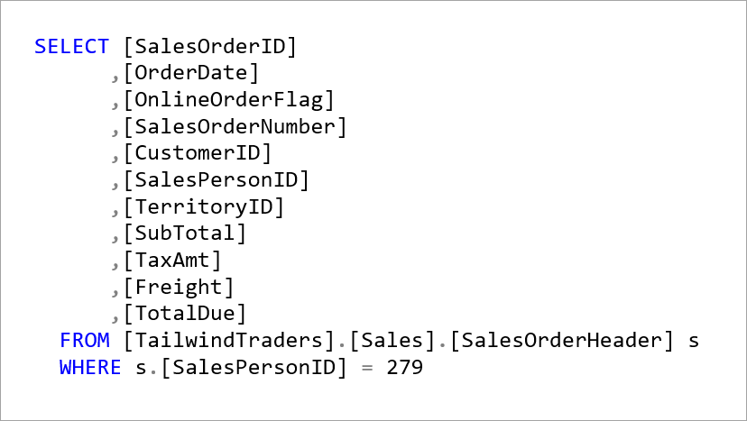

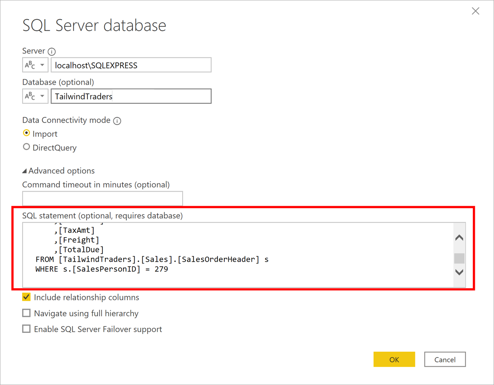

When the connection is made, the data is shown in the preview window.

### Step 2: Load Data in Power Query Editor
- The data preview will appear.
- Click **Edit** to open it in **Power Query Editor**.

### Step 3: Create a Parameter by following steps
1. Go to **Home > Manage Parameters > New Parameter**.
2. On the **Parameters** window, change the default parameter name to something more descriptive so that its purpose is clear. In this case, you change the name to **SalesPerson**.
3. Set **Type** to `Text`.
4. Set **Suggested Values** to `Any value`.
5. Click **OK**.

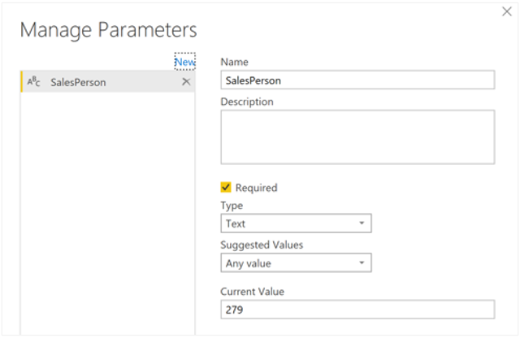

A new query is shown for the parameter that you created.

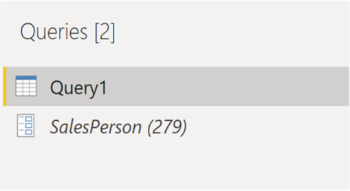

Now, you need to adjust the code in SQL query to assess your new parameter:

### Step 4: Modify SQL Query with Parameter
1. Right-click `Query1` > **Advanced Editor**.
2. Replace hardcoded values with `" & SalesPerson & "` in the SQL string as illustrated in the following image.

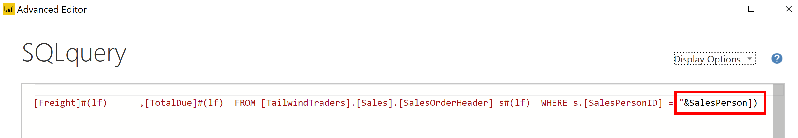

3. Make sure that no errors are shown at bottom of the window and then select **Done**.

Though you don't see a difference on the screen, Power BI ran the query.

### Step 5: Test the Parameter

To confirm that the query was run, you can run a test by selecting the parameter query and entering a new value in the **Current Value** box.

1. Select the **parameter query**.
2. Enter a new value in the **Current Value** field.

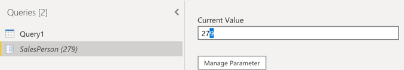

3. A warning icon might display next to the query. If so, select that query to view the warning message, which states that permission is required to run this native database query.
Select **Edit Permission** and then select **Run**.
(
	-	If a warning icon appears, click it.
	-	Select **Edit Permission > Run**.
)
When the query runs successfully, the parameter displays the new value.

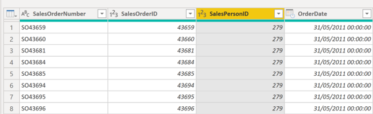

4. Select **Close and Apply** to return to the report editor.

### Step 6: Now, you can apply the parameter to the report:

Apply Parameter to Report

1. Go to **Edit queries > Edit parameters**.
2. On the **Edit Parameters** window, enter a new value and then
3. Click **OK > Apply changes**.
4. Run the native query again if prompted.

Now, when you view the data, you see the data for the new value that was passed through the parameter.

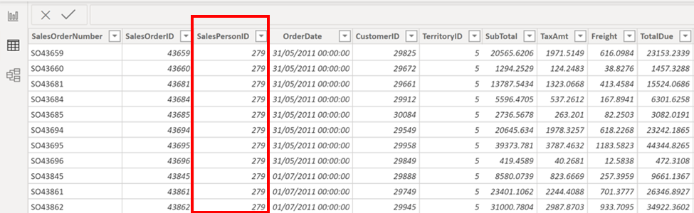
---

## Creating Dynamic Reports for Multiple Values

To accommodate multiple values at a time, you first need to create a Microsoft Excel worksheet that has a table consisting of one column that contains the list of values.

Next, use the Get data feature in Power BI Desktop to connect to the data in that Excel worksheet, and then follow these steps:

### Step 1: Prepare Excel Worksheet
1. Create a table in Excel with a single column of values (e.g., SalesPersonIDs).
2. Save and close the Excel file.

### Step 2: Connect Excel Worksheet in Power BI
1. Select **Get Data > Excel Workbook**.
2. Choose your Excel file.
3. Select the table and click **Edit** to open it in Power Query Editor.
4. Rename the column (e.g., to `SalesPersonID`).
5. Change data type to `Text`.
6. Rename the query to `SalesPersonID`.

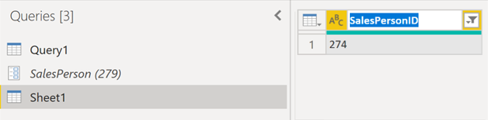

### Step 3: Create a Function: 
Next, you need to create a function that passes the new SalesPersonID query into Query1

1. Right-click on `Query1` > **Create Function**.

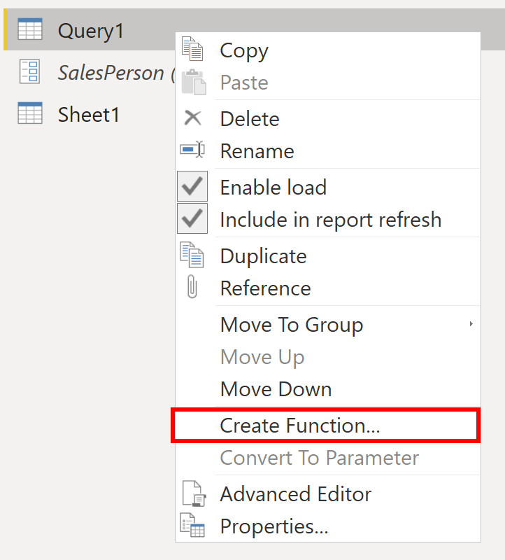

2. Enter a name for the function (e.g., `GetSalesFromSalesPerson`).
3. then Click **OK**.

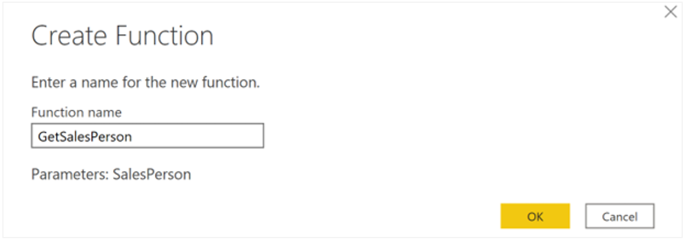

Your new function appears in the Queries pane.

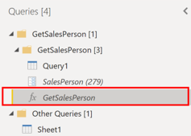

### Step 4: Disable Load for Query1
To ensure that **Query1** doesn't show up in the field list for the report, which could potentially confuse users, you can disable it from loading in the report by right-clicking **Query1** 
again and then selecting **Enable load** (selected by default) to disable the feature.

- Right-click on `Query1` and uncheck **Enable load**.

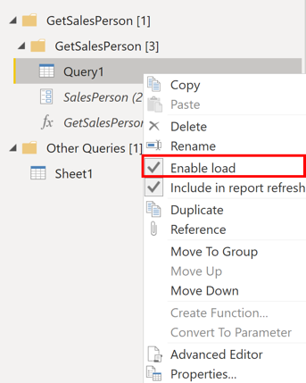

### Step 5: Invoke Custom Function
Select **Invoke custom function** to run the custom function that you created.

1. Select `SalesPersonID` query.
2. Go to **Add Column > Invoke Custom Function**.

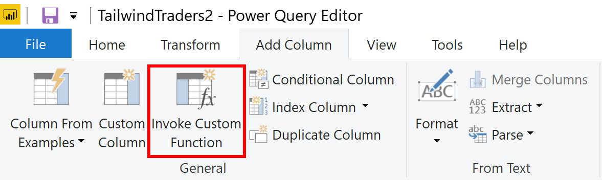

3. Choose your function- On the Invoke Custom Function window, select your function from the **Function query** list.
4. Match the parameter with the Excel column.

The New column name updates automatically and the table that contains the values that you're going to pass through the parameter is selected by default.

5. Click **OK**.

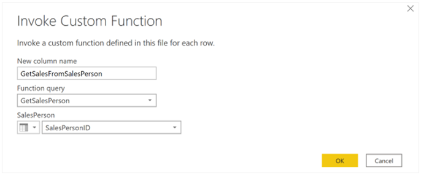

A new column for your GetSalesFromSalesPerson function appears next to the SalesPersonID column.

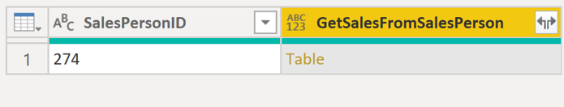

### Step 6: Expand Returned Table

Select the two arrows icon in the new column header and then select the check boxes of the columns that you want to load. This section is where you determine the details that are available in the report for each value (sales person ID).

1. In the new column, click the **expand icon (two arrows)**.
2. Select the columns you want to keep.
3. Uncheck **Use original column name as prefix**.
4. Click **OK**.

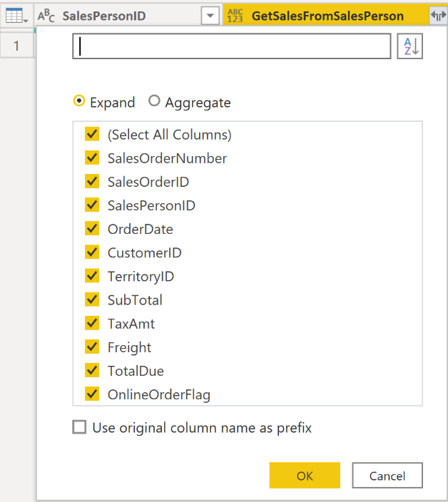

You should be able to view the data for the columns that you selected, for each value (sales person ID).

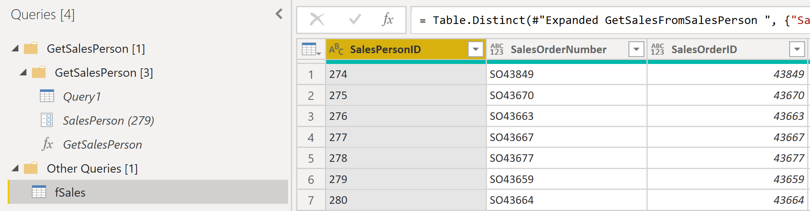

If necessary, you can add more values (sales people IDs) to the SalesPersonID column in the Excel worksheet, or you can change the existing values.

**Save your changes and then return to Power Query Editor.**

### Step 7: Refresh Data
On the **Home** tab, select **Refresh Preview**, and then run the native query again (if necessary). You should see the sales from the new sales people IDs that you added into the worksheet.

- Add more values in the Excel file if needed.
- In Power BI, go to **Home > Refresh Preview**.
- Run the native query again if prompted.

### Step 8: Load Data to Report Editor
1. Click **Close & Apply**.
2. Your selected columns will now appear in the **Fields** pane.

Now, you can start building your report.

---

## Conclusion
With dynamic parameters, reports can show data for individual or multiple values based on user inputs. Parameters linked to external files like Excel enable scalable and reusable reports that adapt to new data without recreating the report logic.

These steps empower users to filter and analyze their data dynamically, providing greater flexibility and improving the decision-making process.

