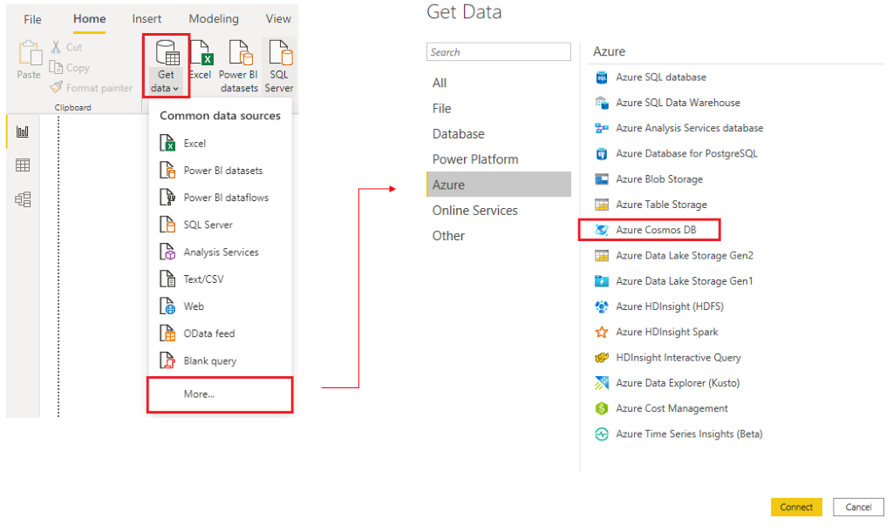

# 🌐 Get Data from a NoSQL Database in Power BI

Some organizations use **NoSQL databases** instead of traditional relational databases. A **NoSQL database** (also known as *non-SQL*, *not only SQL*, or *non-relational*) is a flexible data structure that doesn't rely on tables to store data.

---

## 🏢 Scenario: Tailwind Traders

Developers at **Tailwind Traders** built an application to manage shipping and tracking for products in their warehouses. This application uses **Azure Cosmos DB**, a NoSQL database, as its backend.

- Data is stored as **JSON documents**
- JSON is an open standard format used to transmit data between servers and web apps
- Your task: **Import this JSON data into Power BI** for reporting and analysis

---

## 🔌 Connect to Azure Cosmos DB

To connect Power BI Desktop to a NoSQL data source like Cosmos DB:

1. Open Power BI Desktop and go to **Home > Get Data**
2. Select **More...**
3. In the **Azure** category, choose **Azure Cosmos DB**
4. Click **Connect**

> 📸 _Screenshot: Get Data from Azure Cosmos DB option_

---

## 🔐 Enter Connection Details

1. On the **Preview Connector** window, click **Continue**
2. Enter your Cosmos DB **account details**:
   - **Account endpoint URL** (found in the **Keys** blade in Azure portal)
   - **Database name** and **collection name**, or use the **navigator**
3. If it's your first time connecting:
   - Enter your **account key**
   - You can find it in the **Primary Key** box in the **Read-only Keys** blade in Azure portal

---

## 📥 Import and Normalize JSON Data

JSON data is often **nested or unstructured**, so you'll need to **extract and normalize** it before using it in reports.

### Steps:

1. After connecting, the **Navigator** window shows a list of available databases
2. Select the **Product** table (or your relevant collection)
3. Note: The preview may show items as **Record** types

---

## 🛠 Transform Data in Power Query

1. Click **Edit** to open **Power Query**
2. Click the **Expand** button next to the `Column1` header
   - A list of fields from the JSON document will appear
   - Select the fields you want to include
   - **Uncheck** the _Use original column name as prefix_ option
   - Click **OK**

---

## ✅ Load the Data

1. Review your transformed data to ensure everything looks correct
2. Click **Close & Apply** to load the data into Power BI Desktop

---

## 📊 Final Result

- Your JSON data is now structured as a **table** with rows and columns
- Data from **Cosmos DB** can now be related to other sources
- You're ready to build rich **Power BI reports** using this unified data

---

> 💡 **Tip:** Using Power Query, you can prepare complex, nested data structures for seamless integration with other datasets and powerful visualization in Power BI.

