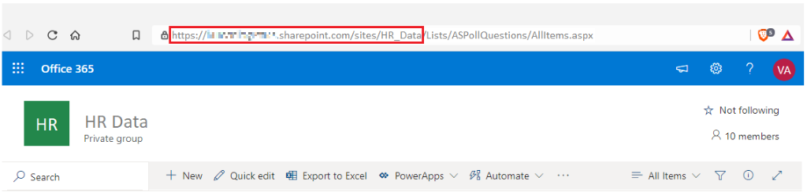
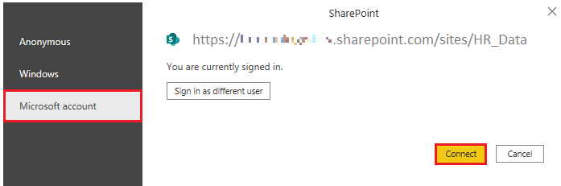
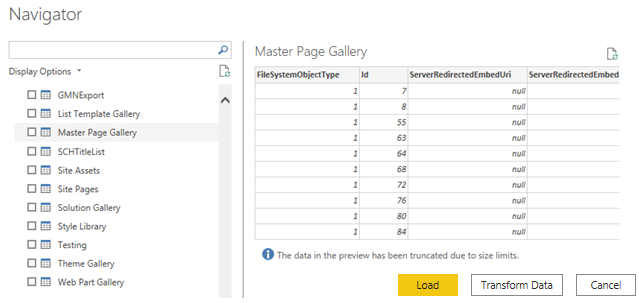

# ☁️ Get Data from Online Services in Power BI

Organizations often rely on various **online services**—such as **SharePoint**, **OneDrive**, **Dynamics 365**, **Google Analytics**, and others—to support their operations. These applications generate their own sets of data, which **Power BI can combine** to deliver more meaningful insights and powerful reports.

---

## 🏢 Scenario: Tailwind Traders

At **Tailwind Traders**, the team uses **SharePoint** to collaborate and store sales data. At the start of the new financial year, **sales managers want to enter new sales goals**.

The leadership uses a **form in SharePoint** to collect these goals, and **you are required** to connect this data to Power BI Desktop. This way, the new goals can be analyzed alongside existing sales data to assess the health of the **sales pipeline**.

---

## 🔌 Connect to Data from an Application

To connect to external application data in Power BI Desktop:

1. Open **Power BI Desktop**
2. Click **Home > Get data**
3. In the **Online Services** category, select the relevant option.
   - **Example**: Choose **SharePoint Online List**

---

### 🔗 Enter Your SharePoint URL

After selecting **Connect**, you'll be prompted to enter your **SharePoint site URL**.

- Use the URL that you typically enter into your browser to access SharePoint
- You **don’t need the full file path**—only the **site URL**
- You may need to **remove the last part** of the copied URL to format it correctly

---

### 🔐 Sign In to Authorize Access

Power BI needs to authenticate your access to SharePoint.

1. Sign in with your **Microsoft account**
2. Click **Connect**

---

## 📥 Choose the Application Data to Import

Once authenticated, the **Navigator** window will appear—just like when connecting to other data sources.

- You’ll see a list of **tables and entities** from your SharePoint site
- Choose the **list** you want to load into Power BI Desktop

### Load vs Transform:

- Click **Load** to directly import the data
- Click **Transform Data** to open **Power Query Editor** if you want to shape and clean the data before loading

---

## ✅ Summary

With Power BI's ability to connect to **online services**, you can:

- Seamlessly import application data (like SharePoint lists)
- Combine it with other data sources
- Deliver rich, interactive dashboards and insights

This approach allows organizations to **make data-driven decisions faster**, by centralizing business data in a single analytical platform.

